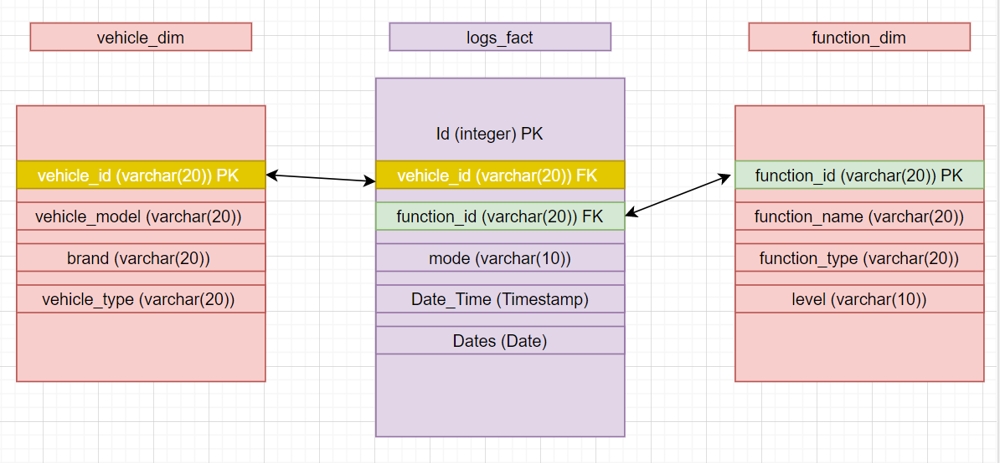
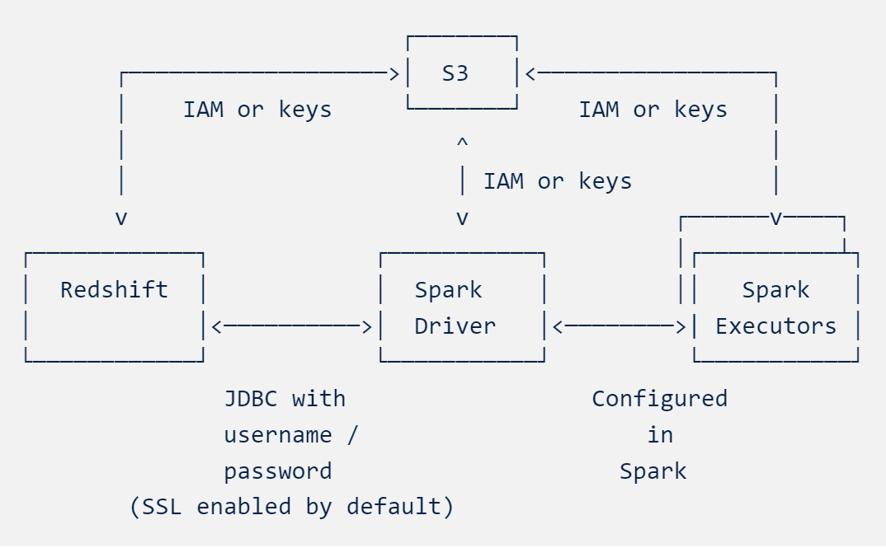
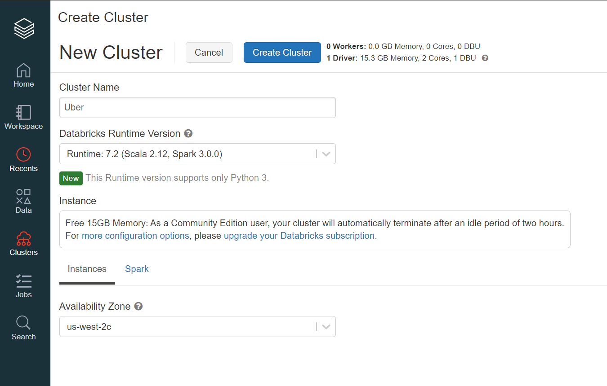
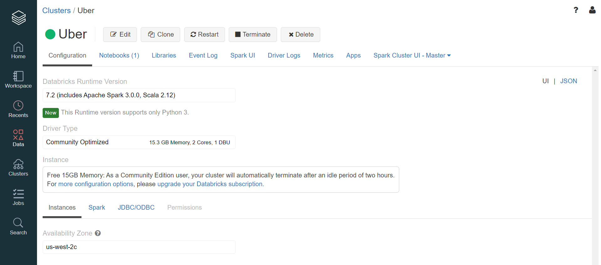
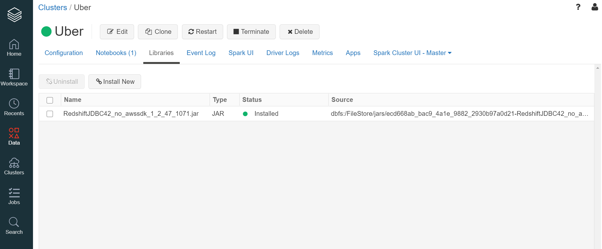
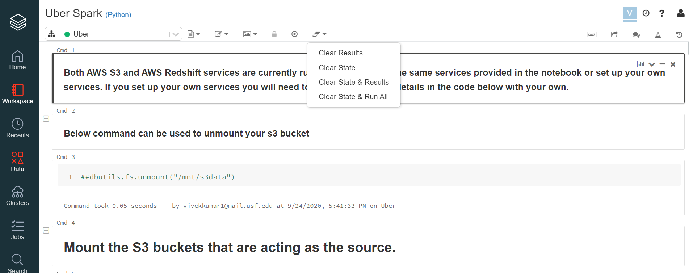

# Uber Data Pipeline
## Topics
### 1) Data model and Assumptions
### 2) ETL Architecture
### 3) Requirements
### 4) Steps for Running/Deploying the application
### 5) References

1. Data model and Assumptions:

a) Data Model:

My data model consists of three tables. Each of these tables have been extracted from the log file provided. The below image explains the column types and relationships between the tables. The Fact table has an ID column as auto increment which is the primary key of the table. The Date_Time and Dates columns have been extracted from the timestamp column in the log file provided. The vehicle and function dimensions have their primary keys as vehicle_id and function_id respectively. At this stage I am assuming the dimensions are not slowly changing dimensions but only contain details about the vehicles and functions. I am only extracting the vehicle_id and function_id columns for the two dimensions from the log file provided. I have created the other columns in both the dimensions as examples to show how these dimensions can hold information about the vehicles and functions. There are pure assumptions and can change as per requirement.

b) Assumptions: 

1) This process is a batch process that runs once every day. The logs are dumped in the S3 bucket through out the day and cleared after the ETL job is complete.
2) Every day the logs are deleted after the ETL job is run and hence, there cannot be an instance where the same logs were uploaded on 2 different days or stay in the bucket to be processed in two different batches.
3) The dimensions are unique on a vehicle and function level respectively. In this version we are not considering slowly changing dimensions. All other columns of the two dimension tables are populated using processes that run apart from this process.
4) This process only adds unique vehicle ids and function ids to the dimension table.

2. ETL Architecture:

a) Services leveraged:

I have created an ETL process using AWS S3, AWS Redshift and Databricks platforms.
I have used AWS S3 buckets as the source of the data. Databricks clusters are being used to extract and transform the data using python and spark apis. Finally, Redshift for loading the data in a warehouse, that holds the data. The code for the whole process is one single databricks notebook (python/ipynb file). This notebook integrates all the services together using different libraries in python and databricks.

b) Architecture diagram:

The python program extracts data stored in an S3 bucket. You need to spinup a Databricks cluster to run the code using the free service on the community edition. The S3 bucket is mounted on the Databricks cluster you are running your code on. You need to install the JDBC coonector for Redshift which is available as a jar file on the AWS website.
The data source uses Amazon S3 buckets to efficiently transfer data in and out of Redshift, and uses JDBC to automatically trigger the appropriate COPY and UNLOAD commands on Redshift. The spark ecosystem is configured and ready to use on you Databricks cluster.

The data source reads and writes data to S3 when transferring data to/from Redshift. As a result, it requires AWS credentials with read and write access to an S3 bucket (specified using the tempdir configuration parameter). You need to assign a role to your Redshift cluster with S3 Allaccess for this process.

I have provided the link and method of installation for the JDBC connector below in the requirements section. 

The diagram below explains the connections between S3, Databricks and Redshift.

The data from the S3 bucket is loaded into a spark dataframe using the code and the transformation is performed on the Databricks cluster. After the transformation is complete the tables are created on the Redshift database you have assigned and the data is loaded to the tables. The first time you run the code, the tables are created and the data is loaded. Every other time when you run the code, the data is appended to the existing tables. You can drop the tables from the assigned database on Redhsift and run the code again. It will create the tables and load data into them.

3. Requirements:

For running this project you will not need any services at the time from your end to hold the data in the source or target databases. I have kept the s3 buckets (source) and Redhsift cluster (target) live for you to run the code for the next few days.

But you will need to spinup a Databricks cluster, which is free on the Databricks community edition for running the program. I have explained how you can spinup the cluster and run the forked ipynb file from my github account on the databricks cluster below.

Also, you can download the S3 browser, if you want to upload or download files in the source s3 bucket. You can use the credentials embedded in my python notebook that you will fork to run the code. S3 browser can be downloaded from the link below. https://s3browser.com/download.aspx

4. Steps for Running/Deploying the application:

Step1: Fork this github repository and download the ipynb file named "Uber Spark".

Step 2: Click on this link to download the JDBC for Redshift. Click to download the file where it says "JDBC4.2–compatible driver (without the AWS SDK) and driver dependent libraries for AWS SDK files version 1.2.47". Extract the jars from the zip file you downloaded. You need only "RedshiftJDBC42-no-awssdk-1.2.47.1071.jar" file so just keep it in a safe location where you can find it.

Step 3: Create an account of Databricks Community edition. https://community.cloud.databricks.com/login.html . Click on signup and follow the steps. Verify email address and click on the link you get in your email to verify account and create password. 

Step 4: When you have logged in to Databricks, on the leftside pane select on clusters. You can give any name to your cluster and Databricks runtime version stays to default "7.2 (Scala 2.12, Spark 3.0.0)". Click on create cluster. 

You can see the green circle when the cluster is in active state.

Step 5: Click on libraries option under the clone tab, select "install new" and drop the jar file you downloaded and unzipped in Step 2. Click on the "install" button. You will see the below status. You are all set to run the code now.

Step 6: Go to the workspace tab from the leftside panel. Click on "workspace". Select the drop down icon and click on "import". Choose the "Uber Spark" ipynb notebook from the location you downloaded it to. Now click on the import button in blue.

Step 7: Once you have opened the notebook. You can go about running the code block by block or at once by clicking on the clear state and run all option.

 Step 8: You can now start querying the database on Redshift to perform further analysis on the data using the platform of your choice. Also, the other ETL jobs for populating columns in the dimension table can be scheduled. 
 
 Step 9: You can schedule this code as a daily job on the Databricks cluster. It gives you a UI based interface for easy scheduling of your jobs.
 
 
 5. References:
 a) https://docs.databricks.com/data/data-sources/aws/amazon-redshift.html
  
